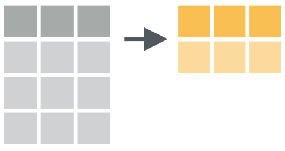

```{r setup, include=FALSE}
source(here::here("docs/knitr-setup.R"))
library(tidyverse)
library(flipbookr)

knitr::opts_chunk$set(cache = FALSE)

# knitr::purl("docs/index.Rmd")
# fs::file_move("index.R", "docs/index.R")
```

## Antes de empezar

- Repositorio del curso https://github.com/jbkunst/visualizacion-de-datos-aplicada-ayudantia-R 
encontraremos el programa, clases, datos.

- La bibliografía complementaría será _R para ciencia de datos_ https://es.r4ds.hadley.nz/, 
nos servirá como guía.

---

# Temas ayudantía

1. [Visualización](https://es.r4ds.hadley.nz/visualizaci%C3%B3n-de-datos.html)
  - Codificación de información.
  - Mapeos de variables.
  - [{ggplot2}](https://github.com/rstudio/cheatsheets/raw/main/translations/spanish/data-visualization_es.pdf).
2. [Manipulación](https://es.r4ds.hadley.nz/transform.html)
  - Verbos/acciones.
  - [{dplyr}](https://github.com/rstudio/cheatsheets/blob/main/translations/spanish/data-transformation_es.pdf).
3. [Comunicación](https://es.r4ds.hadley.nz/r-markdown.html)
  - Mardown, formatos: html, doc, pdf, etc.:
  - [{rmarkdown}](https://github.com/rstudio/cheatsheets/raw/main/translations/spanish/rmarkdown_es.pdf).
  - [{htmlwidgets}](https://gallery.htmlwidgets.org/).


---

class: center, inverse, middle

# R y Rstudio

#### Nuestro ambiente de trabajo_

---

## R y Rstudio 

R es el lenguaje de programación que utilizaremos (como C++, python) y RStudio es un IDE para
R (como PyCharm para python por ejemplo).

Para utilizar R se puede hacer, en un principio, de dos maneras:

- Local, Instalar R y RStudio en tu PC.
- Utilizar desde la nube con https://posit.cloud/.

Más detalles en las diferencias en https://github.com/rivaquiroga/taller-r-doctorado-educacion-2022/blob/master/preparacion-instalacion.md

Para conocer un poco más de RStudio https://github.com/rivaquiroga/RLadies-Santiago/blob/master/primeros_pasos_en_R.md.

---

## Setup de PositCloud (ex Rstudio Cloud)

<center>
<iframe width="784" height="441" src="https://www.youtube.com/embed/B2PJQxRuMFw" title="YouTube video player" frameborder="0" allow="accelerometer; autoplay; clipboard-write; encrypted-media; gyroscope; picture-in-picture" allowfullscreen></iframe>
</center>

Replicar el repositorio: https://github.com/jbkunst/visualizacion-de-datos-aplicada-ayudantia-R

---

class: center, inverse, middle

# Visualización de datos

#### Análisis exploratorio de datos_


---

## Análisis Exploratorio de Datos

El **Análisis Exploratorio de Datos** se refiere a un ciclo iterativo en el que:

- Generas preguntas acerca de tus datos.
- Buscas respuestas visualizando, transformando y modelando tus datos.
- Usas lo que has aprendido para refinar tus preguntas y/o generar nuevas interrogantes.

Lo anterior es un _copy & paste_ desde [R4DS](https://es.r4ds.hadley.nz/an%C3%A1lisis-exploratorio-de-datos-eda.html#an%C3%A1lisis-exploratorio-de-datos-eda).


```{r out.width="60%", fig.align='center', echo=FALSE}
knitr::include_graphics("images/data-science-explore.svg")
```


---

## Visualización

Definiremos la visualización, en el contexto de análisis de datos, como una manera
de representar/codificar información, y por tanto una herramienta para analizar
datos.

```{r out.width="60%", fig.align='center', echo=FALSE}
knitr::include_graphics("images/data-viz.jpg")
```

---

## `ggplot2`

```{r out.width="50%", fig.align='center', echo=FALSE}
knitr::include_graphics("images/viz-mapping-vars.png")
```

De forma **general**:

```
ggplot(data = <DATOS>) +
  <GEOM_FUNCIÓN>(mapping = aes(<MAPEOS>))
```

---

## `ggplot2`

```{r out.width="50%", fig.align='center', echo=FALSE}
knitr::include_graphics("images/viz-mapping-vars.png")
```

De forma **particular**:

```
ggplot(data = datos) +
  geom_point(mapping = aes(x = foo, y = bar, size = zaz))
```

---

## Hagamos un _copy & paste_

```{r out.width="70%", fig.align='center'}
library(datos)
library(ggplot2)

ggplot(data = millas) +
  geom_point(mapping = aes(x = cilindrada, y = autopista))
```

---

## Hagamos un _copy & paste_ (v2)

```{r out.width="70%", fig.align='center'}
library(datos)
library(ggplot2)

ggplot(millas) +
  geom_point(aes(cilindrada, autopista))
```

---

## Revisemos los datos

```{r out.width="70%", fig.align='center'}
library(dplyr)

glimpse(millas)
```

---

```{r, include=FALSE}
ggplot2::theme_set(
  ggplot2::theme_gray(base_size = 7) +
  theme(legend.position = "bottom")
)
```

`r flipbookr::chunk_reveal("millas2", break_type = "auto", title = "## Paso a paso", widths = c(1, 1), chunk_options = "fig.height = 2.7, fig.width = 3")`

```{r millas2, include = FALSE}
ggplot(
  millas, 
  aes(cilindrada, autopista)
  ) +
  geom_point(aes(color = traccion)) +
  geom_smooth() +
  scale_color_viridis_d(option = "magma") +
  facet_wrap(vars(anio)) +
  labs(
    title = "Un hermoso título",
    subtitle = "Un bello y extenso subtítulo",
    caption = "Un texto que nadie mira",
    x = "Cilindrada vehículo cc",
    y = "Rendimiento en autopista km/lts",
    color = "Tipo tracción"
    )
```

---

## A la consola!

Ejecutar el script `R/01-script-de-bienvenida.R`

(Quizás antes el "R/00-instalar-dependencias.R")

---

## Ejercicio 1

1. Cargue los paquetes `datos`, `ggplot2` y `dplyr`.
1. Ejecute `glimpse(vuelos)`.
1. Objtenga una _muestra_ de 10.000 registros para responder las preguntas utilizando la función `sample_n` (hint (?): `sample_n(vuelos, 1000)`). 
1. ¿Cuántos filas/columnas tienen los datos?
1. ¿Cuántos datos son numéricos?
1. Explore la relación entre `distancia` y `tiempo_vuelo`.
1. ¿Qué otras preguntas tienes? ¿Como podríamos obtener QUE vuelo es/son el/los más largos?
1. Reutiliza el código del ejemplo paso a paso para utilizar la función `facet_wrap` 
con estos datos.

---

```{r, include=FALSE}
ggplot2::theme_set(
  ggplot2::theme_minimal(base_size = 7) +
  theme(legend.position = "bottom")
)
```

`r flipbookr::chunk_reveal("vuelos_sample", break_type = 5, title = "## Sirve obtener una **muestra**?", widths = c(1, 1), chunk_options = "fig.height = 2.7, fig.width = 3")`

```{r vuelos_sample, include = FALSE}
vuelos2 <- sample_n(vuelos, 5000)

ggplot(vuelos2, aes(distancia, tiempo_vuelo)) +
  geom_point(alpha = 0.05, color = "gray60") +
  geom_smooth(se = FALSE, color = "darkred") +
  scale_x_continuous(labels = scales::comma) +
  scale_y_continuous(limits = c(0, 650))
```

---

.center[
```{r, echo=FALSE, out.width="90%"}
knitr::include_graphics("images/ggplot_elements2.png")
```
]

https://bookdown.org/alapo/learnr/data-visualisation.html

---

## Más información sobre visualización

- [Visualización de datos](https://es.r4ds.hadley.nz/visualizaci%C3%B3n-de-datos.html#introducci%C3%B3n-1) en R4DS.

- A _simple_ intro to `ggplot2`. [Post](https://www.rforecology.com/post/a-simple-introduction-to-ggplot2/).

- Visualización desde el análisis de datos. [Slides](https://jkunst.com/slides/202107-visualizacion-desde-el-analsis-de-datos/index.html).


---

class: center, inverse, middle

# Transformación y manipulación de datos

```{r, include=FALSE}
storms <- readr::read_csv(here::here("data/storms.csv"))
pollution <- readr::read_csv(here::here("data/pollution.csv"))
```

---

## Transformación de datos

> La visualización es una herramienta importante para la generación de conocimiento; sin embargo, es raro que obtengas los datos exactamente en la forma en que los necesitas. A menudo tendrás que crear algunas variables nuevas o resúmenes, o tal vez solo quieras cambiar el nombre de las variables o reordenar las observaciones para facilitar el trabajo con los datos.

Lo anterior es un _copy & paste_ desde [R4DS](https://es.r4ds.hadley.nz/transform.html).

---

## `dplyr` Lo básico

En este capítulo, aprenderás las cinco funciones clave de **dplyr** que te permiten resolver la gran mayoría de tus desafíos de manipulación de datos:

* Filtrar o elegir las observaciones por sus valores (`filter()` — del inglés filtrar).
* Reordenar las filas (`arrange()` — del inglés organizar).
* Seleccionar las variables por sus nombres (`select()` — del inglés seleccionar).
* Crear nuevas variables con transformaciones de variables existentes (`mutate()` — del inglés mutar o transformar).
* Contraer muchos valores en un solo resumen (`summarise()` — del inglés resumir).

Todas estas funciones se pueden usar junto con `group_by()` (del inglés _agrupar por_), que cambia el alcance de cada función para que actúe ya no sobre todo el conjunto de datos sino de grupo en grupo.

---

## `dplyr` Lo básico (2)

Todos los verbos funcionan de manera similar:

1. El primer argumento es un *data frame*.

2. Los argumentos posteriores describen qué hacer con el *data frame* usando los nombres de las variables (sin comillas).

3. El resultado es un nuevo *data frame*.

En conjunto, estas propiedades hacen que sea fácil encadenar varios pasos simples para lograr un resultado complejo.

Nuevamente, lo anterior es un _copy & paste_ desde [R4DS](https://es.r4ds.hadley.nz/transform.html).

---

background-image: url(images/dplyr/dplyr_filter.jpg)
background-size: cover

---

## `filter` Seleccionar Filas

```{r out.width='70%', fig.align='center', echo=FALSE}
knitr::include_graphics("images/dplyr/filter.png")
```

---

## `filter` ejemplo

```{r out.width='80%', fig.align='center', echo=FALSE}
knitr::include_graphics("images/dplyr/filter_example.png")
```

---

`r flipbookr::chunk_reveal("filter", title = "## <code>filter</code> Código", widths = c(1, 1))`

```{r filter, include = FALSE}
storms |>
  filter(storm %in% c("Alberto", "Ana"))
```

---

## `select` Seleccionar Columnas

```{r out.width='70%', fig.align='center', echo=FALSE}
knitr::include_graphics("images/dplyr/select.png")
```

---

## `select` ejemplo

```{r out.width='80%', fig.align='center', echo=FALSE}
knitr::include_graphics("images/dplyr/select_example.png")
```

---

`r flipbookr::chunk_reveal("select", title = "## <code>select</code> Código", widths = c(1, 1))`

```{r select, include = FALSE}
storms |>
  select(storm, pressure)
```

---

## `arrange` Ordenar Filas

```{r out.width='70%', fig.align='center', echo=FALSE}
knitr::include_graphics("images/dplyr/arrange.png")
```

---

## `arrange` ejemplo

```{r out.width='80%', fig.align='center', echo=FALSE}
knitr::include_graphics("images/dplyr/arrange_example.png")
```

---

`r flipbookr::chunk_reveal("arrange", title = "## <code>arrange</code> Código", widths = c(1, 1))`

```{r arrange, include = FALSE}
storms |>
  arrange(wind)
```

---

background-image: url(images/dplyr/dplyr_mutate.png)
background-size: contain

---

## `mutate` Crear (o transformar) Columnas

```{r out.width='70%', fig.align='center', echo=FALSE}
knitr::include_graphics("images/dplyr/mutate.png")
```

---

## `mutate` ejemplo

```{r out.width='80%', fig.align='center', echo=FALSE}
knitr::include_graphics("images/dplyr/mutate_example.png")
```

---

`r flipbookr::chunk_reveal("mutate", title = "## <code>mutate</code> Código", widths = c(1, 2))`

```{r mutate, include = FALSE}
storms |> 
  mutate(
    ratio = pressure/wind,
    inverse = 1/ratio
    ) |> 
  mutate(wind = log(wind))
```

---

## `summarise` Resumir Columnas

```{r out.width='70%', fig.align='center', echo=FALSE}

```

---

## `summarise` ejemplo

```{r out.width='80%', fig.align='center', echo=FALSE}
knitr::include_graphics("images/dplyr/summarise_example.png")
```

---

`r flipbookr::chunk_reveal("summarise", title = "## <code>summarise</code> Código", widths = c(1, 1))`

```{r summarise, include = FALSE}
pollution |>
  summarise(median = median(amount))
```

---


## `group_by |> summarise` Resumir Columnas por Grupos

```{r out.width='70%', fig.align='center', echo=FALSE}
knitr::include_graphics("images/dplyr/group_by_summarize.png")
```

---

## `group_by |> summarise` ejemplo

```{r out.width='80%', fig.align='center', echo=FALSE}
knitr::include_graphics("images/dplyr/group_by_summarize_example.png")
```

---

`r flipbookr::chunk_reveal("group_by", title = "## <code>group_by |> summarise</code> Código", widths = c(1, 1))`

```{r group_by, include = FALSE}
pollution |> 
  group_by(city) |>
  summarise(
    mean = mean(amount),
    sum = sum(amount),
    n = n()
  )
```


---

`r flipbookr::chunk_reveal("group_by_spanish", title = "## <code>group_by |> summarise</code> Código <small>(spanish version)</small>", widths = c(1, 1))`

```{r group_by_spanish, include = FALSE}
pollution |> 
  group_by(city) |>
  summarise(
    promedio = mean(amount),
    suma = sum(amount),
    conteo = n()
  )
```


---

## Ejercicio 2

<small>

1. Cargue el paquete `tidyverse`, y cree un data frame con columnas `x` e `y`, cada una de las columnas
sea 1000 números aleatorios entre -1 y 1 (recuerde la función `runif`).
1. Genere un gráfico de puntos visualizando como se relacionan las variables `x` e `y`.
1. Con la función `mutate` cree una variable  `r` que sea igual a `x^2 + y^2`, es decir $x^2 + y^2$.
1. Utilize la función `if_else` (y `mutate`) para generar una cuarta variable cuya definición es: si `r` es mayor que 1 entonces vale "A", en caso contrario "B". Llame esta variable como `r2`.
1. Ahora vuelva generar el gráfico de 3. pero coloreando el punto de acuerdo a la variable `r2`.
1. Utilice el _combo_ `group_by(r2) |> count()` para contar cuantos son "A" y "B", y luego generar la columna `p = n/sum(n)`. 
1. Cree la columna `es_b` que indique con un 1 si el valor de `r2` es "B" y 0 si es "A", para luego
crear la columna `convergencia` al aplicar la función `cummean` a la columna `es_b`.
1. con ayuda de la función `row_number()` genere la columna `fila` y haga un gráfico de líneas 
con `x = fila` e `y = 4 * convergencia`.
</small>


---


`r flipbookr::chunk_reveal("solucion", title = "## Posible solución", widths = c(1, 1))`

```{r solucion, include = FALSE}
library(tidyverse)

set.seed(123)

df <- tibble(
  x = runif(1000, -1, 1),
  y = runif(1000, -1, 1)
)

df |> 
  mutate(r = x^2 + y^2) |> 
  mutate(r2 = if_else(r > 1, "A", "B")) |> 
  mutate(es_b = if_else(r2 == "B", 1, 0)) |> 
  mutate(conv = cummean(es_b)) |> 
  mutate(fila = row_number()) 
```

---


`r flipbookr::chunk_reveal("solucion2", title = "## Posible solución v2", widths = c(1, 1), chunk_options = "fig.height = 2.7, fig.width = 3")`

```{r solucion2, include = FALSE}
library(tidyverse)

set.seed(123)

df <- tibble(
  x = runif(10000, -1, 1),
  y = runif(10000, -1, 1)
)

df |> 
  mutate(
    r = x^2 + y^2,
    ri = r < 1,
    conv = cummean(ri),
    row = row_number()
    ) |> 
  ggplot() +
  geom_line(aes(row, 4 * conv)) +
  geom_hline(yintercept = pi, color = "darkred") 
```

---

`r flipbookr::chunk_reveal("solucion3", title = "## Posible solución v3", widths = c(1, 1), chunk_options = "fig.height = 2.7, fig.width = 3")`

```{r solucion3, include = FALSE}
library(tidyverse)

set.seed(123)

tibble(
  x = runif(10000, -1, 1),
  y = runif(10000, -1, 1)
) |> 
  mutate(
    r = x^2 + y^2,
    ri = r < 1,
    conv = cummean(ri),
    row = row_number()
  ) |> 
  ggplot() +
  geom_line(aes(row, 4 * conv)) +
  geom_hline(yintercept = pi, color = "darkred") +
  scale_x_continuous(labels = scales::comma_format()) +
  scale_y_continuous(
    sec.axis = sec_axis(trans = ~., breaks = pi, labels = expression(pi))
  )
```

---
  
## El Pipe (_paip_) `|>`
  
Los pipes son una herramienta poderosa para expresar claramente una secuencia de múltiples operaciones. Hasta aquí, has venido usándolos sin saber cómo funcionan o qué alternativas existen. En este capítulo ya es tiempo de explorarlos en más detalle. En él aprenderás qué alternativas existen, cuándo no deberías utilizarlos y algunas herramientas útiles relacionadas.

De forma general veremos que `z |> f()` es equivalente a `f(z)` y en el caso 
de aplicar parámetros extras tenemos que `z |> g(y)` es `g(x, y)`.

En el próximo ejemplo veremos que el **pipe** (`|>` o `%>%`) ayuda a la 
legibilidad del código.

Más en el capítulo [Pipes](https://es.r4ds.hadley.nz/pipes.html) en R4DS.


---

`r flipbookr::chunk_reveal("pipe", title = "## Ejemplo pipe", widths = c(1, 1))`

```{r pipe, include = FALSE, echo=FALSE}
x <- 34

tan(cos(sqrt(log(x))))

y <- x
y <- log(y)
y <- sqrt(y)
y <- cos(y)
y <- tan(y)
y

x |> 
  log() |> 
  sqrt() |> 
  cos() |> 
  tan()
```


---

class: center, inverse, middle

# rmarkdown

#### Comunicar resultados_

---

## Comunicar resultados

https://es.r4ds.hadley.nz/introducci%C3%B3n-18.html

Hasta aquí, hemos aprendido a usar las herramientas para importar tus datos en R, ordenarlos de una manera conveniente para el análisis, y luego interpretarlos a través de su transformación, visualización y modelado. 

```{r out.width="60%", fig.align='center', echo=FALSE}

```

---

## {rmarkdown}

Revisar https://garrettgman.github.io/rmarkdown/index.html

- R Markdown provee un marco de escritura para ciencia de datos.

- Combina tu código, sus resultados y tus comentarios.

- Los documentos de R Markdown son **reproducibles**.

- Soportan varios formatos de salida tales como PDFs, archivos de Word, presentaciones y más.


---

## Ejemplo .Rmd (<small>rmarkdown/diamond-sizes.Rmd</small>)

.pull-left[
<small>
```{r echo = FALSE, comment = ""}
cat(htmltools::includeText(here::here("rmarkdown/diamond-sizes.Rmd")))
```
</small>
]

.pull-right[
Contiene tres tipos importantes de contenido:

 1. Un encabezado YAML (opcional) rodeado de `---`, Parámetros generales.
 1. __Bloques__ de código de R rodeados de ```` ``` ````.
 1. Texto mezclado con formateos de texto simple como `# Encabezado`, `_itálicas_`,
 `**negrita**`, etc..
]

---

# Formatos

https://garrettgman.github.io/rmarkdown/formats.html

```{r out.width="60%", fig.align='center', echo=FALSE}
knitr::include_graphics("images/RMarkdownFlow.png")
```


1. Documentos: html, word, pdf, y otros.
1. Slides
  - [Xaringan](https://slides.yihui.org/xaringan/).
  - [reavealJS](https://garrettgman.github.io/rmarkdown/revealjs_presentation_format.html), (ejemplo .Rmd [acá](https://github.com/rstudio/revealjs/blob/main/examples/simple.Rmd))
1. Dashboard con [flexdashboard](https://pkgs.rstudio.com/flexdashboard/index.html).
1. Libros, páginas web, blogs, etc, etc.


---

# Ejercicio 3

 
1. Crea un nuevo notebook usando File > New File > R Notebook. Lee las instrucciones. Practica ejecutando los bloques. Verifica que puedes modificar el código, re-ejecútalo, y observa la salida modificada.

2. Crea un nuevo documento R Markdown con File > New File > R Markdown… Haz clic en el icono apropiado de Knit. Haz Knit usando el atajo de teclado apropiado. Verifica que puedes modificar el input y la actualización del output.

3. Compara y contrasta el notebook de R con los archivos de R markdown que has creado antes. ¿Cómo son similares los outputs? ¿Cómo son diferentes? ¿Cómo son similares los inputs? ¿En qué se diferencian? ¿Qué ocurre si copias el encabezado YAML de uno al otro?


---

## HTMLWidgets (extensión/complemento)

HTMLWidgets son un tipo de paquetes que nos permiten realizar visualizaciones en HTML
las cuales se pueden usar en (1) consola, (2) integrar con rmarkdown y también (3) shiny.

Existen una gran cantida de paquetes https://gallery.htmlwidgets.org/, y nos sirven 
para complementar nuestra aplicación. 

- https://plotly.com/r/
- https://jkunst.com/highcharter/
- https://echarts4r.john-coene.com/
- https://rstudio.github.io/leaflet/
- https://rstudio.github.io/DT/

Ejemplo de uso de script `03-clase-script-htmlwidgets.R`.

---

`r flipbookr::chunk_reveal("ggplot2", title = "## Antes, un poco de {ggplot2}")`

```{r ggplot2, include = FALSE}
library(ggplot2)

data(iris)

ggplot(iris, aes(Sepal.Length, Sepal.Width)) +
  geom_point(aes(color = Species), size = 2.5) +
  scale_color_viridis_d(end = .9) +
  geom_smooth(method = "lm") +
  facet_wrap(vars(Species)) +
  theme_minimal()
```

---

`r flipbookr::chunk_reveal("plotly", title = "## {plotly}")`

```{r plotly, include = FALSE}
library(ggplot2)
library(plotly)

data(iris)

p <- ggplot(iris, aes(Sepal.Length, Sepal.Width)) +
  geom_point(aes(color = Species), size = 2.5) +
  scale_color_viridis_d(end = .9) +
  geom_smooth(method = "lm") +
  facet_wrap(vars(Species)) +
  theme_minimal()

ggplotly(p)
```

---

`r flipbookr::chunk_reveal("highcharter", title = "## {highcharter}")`

```{r highcharter, include = FALSE}
library(highcharter)
library(forecast)

data("AirPassengers")

modelo <- forecast(auto.arima(AirPassengers))

hchart(modelo) |>
  hc_add_theme(hc_theme_hcrt()) |>
  hc_navigator(enabled = TRUE) |>
  hc_rangeSelector(enabled = TRUE) |>
  hc_title(text = "Proyección")
```

---

`r flipbookr::chunk_reveal("sismos", title = "## Antes, unos datos", widths = c(1, 2))`  

```{r sismos, include = FALSE}
library(rvest)   # descargar datos de paginas web

url <- "https://www.sismologia.cl/sismicidad/catalogo/2022/07/20220721.html"

read_html(url) |>
  html_table() |>
  dplyr::nth(2) |>
  janitor::clean_names() |>
  tidyr::separate(
    latitud_longitud,
    into = c("latitud", "longitud"),
    sep = " ", convert = TRUE
  )

datos <- read_html(url) |>
  html_table() |>
  dplyr::nth(2) |>
  janitor::clean_names() |>
  tidyr::separate(
    latitud_longitud,
    into = c("latitud", "longitud"),
    sep = " ", convert = TRUE
  )
```

---

`r flipbookr::chunk_reveal("dt", title = "## {DT}", widths = c(1, 4))`

```{r dt, include = FALSE}
library(DT)

datatable(datos)
```

---

`r flipbookr::chunk_reveal("leaflet", title = "## {leaflet}")`

```{r leaflet, include = FALSE}
library(leaflet)

leaflet(datos) |>
  addTiles() |>
  addMarkers(
    lng = ~longitud,
    lat = ~latitud,
    popup = ~as.character(magnitud_2),
    label = ~as.character(`fecha_local_lugar`)
  ) |>
  addProviderTiles("Esri.WorldImagery")
```

---

## HTMLWidgets en reporte/dashboard

<br>

La integración es inmediata **siempre y cuando** el output sea html o 
dashboard (que es también html) y slides (que no sea pdf/ppt).


 
